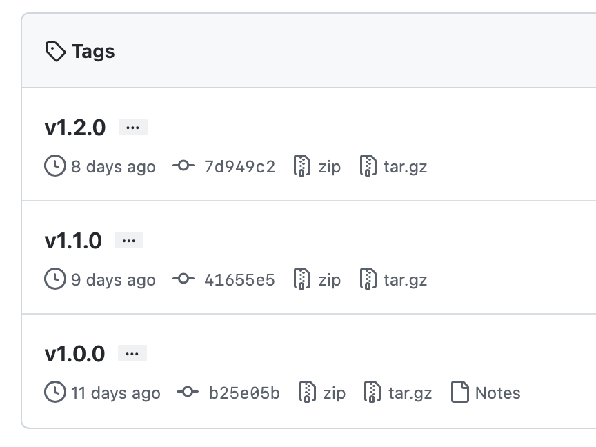
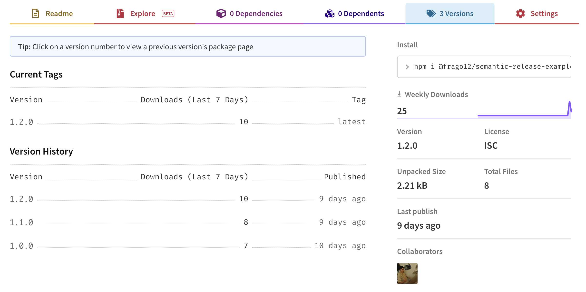
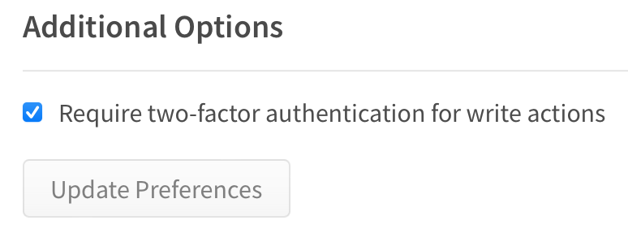

import Highlight from "../../components/Highlight.astro";

Having a fully automated package deployment workflow with semantic versioning is
great, and it is not hard to set it up. This guide will explore how to do it
using GitHub Actions and the npm package
[semantic-release](https://www.npmjs.com/package/semantic-release).

## What does semantic-release do?

`semantic-release` automates creating and publishing package versions to the npm
registry (or any other registry specified).

By default, `semantic-release` does four things:

1. Analyze the commits to figure out the next semantic version.
2. Generate release notes based on the commits.
3. Publish the package to npm.
4. Push a new git tag to Github, indicating the next version.

All that is done by the plugin system that the library provides. By default, it
executes the following plugins:

```json title="Default plugins"
"@semantic-release/commit-analyzer"
"@semantic-release/release-notes-generator"
"@semantic-release/npm"
"@semantic-release/github"
```

`semantic-release` analyze the commit messages to determine the next version.
This is possible because it looks for commit messages that follow the
[commit message format](https://github.com/angular/angular/blob/master/CONTRIBUTING.md#-commit-message-format)
defined by the Angular team.

In the end, we will have semantic versioning with Git tags, and each tag will
represent a different package version on npm.





## Install semantic-release

`semantic-release` is installed via npm.

```bash title="Terminal"
npm install -D semantic-release
```

## Basic configuration

Then, we need to create a config file for semantic-release, `release.config.js`.
In this file, we can set up different options like plugins, release branches,
etcetera (See all
[config options](https://github.com/semantic-release/semantic-release/blob/master/docs/usage/configuration.md#options)).

The only required option is `branches`. At least one release branch needs to be
specified. For this case, we will keep it simple and only add `main` as the
release branch.

```js title="release.config.js" showLineNumbers
const branches = ["main"];

module.exports = { branches };
```

## Create a Github token

As mentioned above, by default, `semantic-release` executes the
`@semantic-release/github` plugin, which requires a GitHub token to operate, so
you need to create one.

<Highlight>
  Here are the docs to [create a GitHub access
  token](https://docs.github.com/en/authentication/keeping-your-account-and-data-secure/creating-a-personal-access-token).
</Highlight>

The minimum scopes required for that token are:

- `repo` for a private repository.
- `public_repo` for a public repository.

The token needs to be loaded via an environment variable that should be named
either `GH_TOKEN` or `GITHUB_TOKEN`.

## Create an npm token

An npm token is required by the `@semantic-release/npm` plugin. This token must
also be loaded via an environment variable named `NPM_TOKEN`.

<Highlight>
  Here are the docs to [create an npm
  token](https://docs.npmjs.com/creating-and-viewing-access-tokens).
</Highlight>

## Perform local deployment

Both `GITHUB_TOKEN` and `NPM_TOKEN` environment variables must be loaded to
perform a local deployment. This can be done in different ways depending on each
use case. One way to do it is using the
[node-env-run](https://www.npmjs.com/package/node-env-run) npm package.

Also, make you specify the correct access to your package in the packge.json
file.

```json title="package.json" showLineNumbers
{
  ...
  "publishConfig": {
    "access": "public"
  }
}
```

<Highlight>
  If you want to publish a private npm package, you need an npm subscription,
  otherwise, you will get a `402 Payment Required` error.
</Highlight>

And then, execute `semantic-release` with the `—no-ci` flag.

```bash title="Terminal"
npx semantic-release --no-ci
```

That’s it. This will generate a new Git tag, push it to the GitHub repository,
and publish the npm package to the npm registry.

## Perform deployment using GitHub Actions

Ideally, package deployments should be done via a Continuous Integration server.
A simple way to automate this is using Github Actions. Here is an example of a
workflow.

```yaml showLineNumbers title=".github/workflows/release.yml"
name: Release workflow

on:
  push:
    branches:
		- main

jobs:
  release:
    runs-on: ubuntu-latest
    steps:
      - uses: actions/checkout@v2

      - uses: actions/setup-node@v2
        with:
          node-version: 16

      - name: Install dependencies
        run: npm install

      - name: Publish
        if: success()
        run: npm run semantic-release
        env:
          GITHUB_TOKEN: ${{ secrets.GITHUB_TOKEN }}
          NPM_TOKEN: ${{ secrets.NPM_TOKEN }}
```

The relevant part of the code above is the `Publish` task, which is executing
`semantic-release` if the previous tasks succeed. Also, notice that both
`GITHUB_TOKEN` and `NPM_TOKEN` are being passed as environment variables.

By default, GitHub exposes a `GITHUB_TOKEN` secret that can be used in GitHub
Actions without needing to create a new token as it was done for the manual
deployment. For the `NPM_TOKEN`, you'll need to create repository secret.

<Highlight>
  Here is how you can create a [repository
  secret](https://docs.github.com/en/actions/security-guides/encrypted-secrets#creating-encrypted-secrets-for-a-repository)
  on GitHub.
</Highlight>

## Custom plugins

Depending on your workflow, It is possible to specify in the config file the
plugins that `semantic-release` should perform. For example, let’s say that in
addition to the plugins that are executed by default, we want to generate a
changelog file that will be automatically updated with the release notes of each
release and commit to the repository.

```js title="release.config.js" showLineNumbers
const branches = ["main"];

const plugins = [
  "@semantic-release/commit-analyzer",
  "@semantic-release/release-notes-generator",
  "@semantic-release/changelog",
  "@semantic-release/npm",
  "@semantic-release/github",
  [
    "@semantic-release/git",
    {
      assets: ["CHANGELOG.md"],
      message: "chore: ${nextRelease.version}\n\n{nextRelease.notes}",
    },
  ],
];

module.exports = { branches, plugins };
```

Notice that two new plugins were added in addition to the default ones,
`@semantic-release/changelog` and `@semantic-release/git`. The first one is in
charge of creating and updating the changelog file, and the second one will
create a new commit and push it to the repo. These two plugins need to be
installed via npm.

<Highlight>
  Here is the [official list of
  plugins](https://semantic-release.gitbook.io/semantic-release/extending/plugins-list)
  supported by `semantic-release.
</Highlight>

## Test semantic-release without publishing (Dry run)

Sometimes, it will be helpful to get a preview of the next release without
publishing anything. This can be done by passing the `--dry-run` or `-d`
argument when performing `semantic-release`.

```bash title="Terminal"
npx semantic-release -d
```

The dry run is also helpful to make sure `semantic-release` is working fine. It
can be annoying to debug when actual deployments are being performed ;).

<Highlight>
  Here’s the documentation to the [dryRun
  argument](https://github.com/semantic-release/semantic-release/blob/master/docs/usage/configuration.md#dryrun).
</Highlight>

## Lint commit messages

To ensure that commits are formatted correctly, you can use something like
[commitlint](https://commitlint.js.org/#/). This tool will allow you to define
different rules, including the valid types and scopes.

```yaml title=".commitlintrc.yaml" showLineNumbers
extends:
  - "@commitlint/config-conventional"

rules:
  scope-enum:
    - 2
    - always
    - - icons # icons library
      - rds # react design system
      - repo # general repo work
      - release # ONLY for semantic-release
  type-enum:
    - 2
    - always
    - - build # affect the build system or external dependencies
      - ci # CI configuration files and scripts
      - docs # documentation only
      - feat # new feature
      - fix # bug fix
      - perf # improves performance
      - refactor # neither fixes a bug nor adds a feature
      - style # do not affect the meaning of the code, e.g. formatting
      - test # add/update/remove tests
```

## Found issues

### npm publish failed - OTP error

One of the reasons this could happen is because publishing a package requires
the OTP code (One Time Password code) if you have 2FA setup.

```bash title="Terminal"
npm ERR! code EOTP
npm ERR! This operation requires a one-time password from your authenticator.
npm ERR! You can provide a one-time password by passing --otp=<code> to the command you ran.
```

A potential solution to this can be the one suggested above in the error
message, but this approach won’t work in automated environments like a CI. A
solution to this problem is to disable 2FA **only** for write actions. This can
be done by disabling that option on your account page on npm.



### npm publish failed - Payment required

If you want to publish a private package, you must have an npm subscription. But
if it’s not your case, make sure you specify the correct access to your package
as [mentioned above](#perform-local-deployment).
